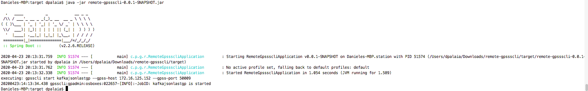

# Remote command for gpsscli

This simple software is intended to be a generic remote execution command implementation. </br>
We are calling remote commands in a another server in this case for gpss/gpsscli command control </br>
The software is written in Java so can be used on any operating system, also with Windows but it requrires a Java8 version installed on your machine.</br>

Inside ./target you can find the .jar to execute remote-gpssscli-0.0.1-SNAPSHOT.jar and a file called remote.properties:

```
host=172.16.125.152
username=gpadmin
password=gpadmin
command=gpsscli list --gpss-host 172.16.125.152 --gpss-port 50009
```

This will be the host, username, password and command to execute in the remote host as an example:

To submit a job with configuration:

```
host=172.16.125.152
username=gpadmin
password=gpadmin
command=gpsscli submit --name kafkajsonlastgp --gpss-host 172.16.125.152 --gpss-port 50009 /home/gpadmin/gpss/gpsscli.yaml
```


To start a job with configuration:

```
host=172.16.125.152
username=gpadmin
password=gpadmin
command=gpsscli start kafkajsonlastgp --gpss-host 172.16.125.152 --gpss-port 50009
```


same to stop the job:

